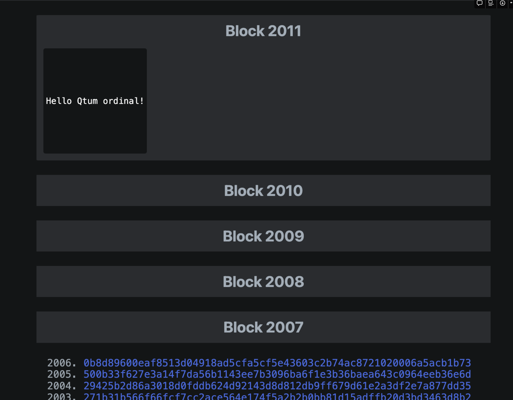

## Overview
This document provides a brief overview of the ordinals wallet for Qtum (`qord`), and how to setup the development environment for it.

## What is `qord`?
`qord` is a wallet for Qtum that is designed to be used to inscribe sat in the Qtum blockchain. It is a fork of the bitcoin's [ordinals wallet](https://github.com/ordinals/ord) that has been modified to work with Qtum.


## Using the development environment

### Clone the repositories

Four repositories should be cloned into the same directory:

```bash
# clone the qord repository
git clone https://github.com/qtumproject/ord.git

# clone the rust-qtum repository
git clone https://github.com/qtumproject/rust-qtum.git

# clone the rust-qtumcore-rpc repository
git clone https://github.com/qtumproject/rust-qtumcore-rpc.git

# clone the rust-miniscript-qtum repository
git clone https://github.com/qtumproject/rust-miniscript-qtum.git
```
The above will clone all the required dependencies linked locally to the `ord` repository.


### Building `qord`

`qord` can be built using the following command:

```bash
cd ord
cargo build --release
```

### Running qtum on regtest

`qord` requires a qtum node to be running on regtest. The easiest way to do this is with docker:

```bash
docker run --name qtum_regtest -d -p 13777:13777 -v $(pwd)/data:/data qtum/qtum:latest qtumd -regtest -txindex -addrindex=1 -rpcbind=0.0.0.0:13777 -rpcallowip=0.0.0.0/0 -logevents -rpcuser=qtum -rpcpassword=qtum -deprecatedrpc=accounts -printtoconsole -debug=1
```

### Alias qord
It is useful to alias `qord` so it runs with the correct arguments:

```bash
export RUST_LOG=debug
export ORD_BITCOIN_RPC_USER=qtum
export ORD_BITCOIN_RPC_PASS=qtum
export CHAIN=regtest

alias qord='RUST_LOG=debug <path to cloned repos>/ord/target/release/qord --regtest --bitcoin-rpc-user qtum --bitcoin-rpc-pass qtum  --rpc-url 127.0.0.1:13777'
```

### Creating a `qord` wallet

```bash
qord wallet create
```

You should see the following output:

```bash
[2023-10-08T21:06:32Z INFO  ord::options] Connecting to Bitcoin Core at 127.0.0.1:13777/wallet/ord
[2023-10-08T21:06:32Z DEBUG bitcoincore_rpc] JSON-RPC request: getblockchaininfo []
[2023-10-08T21:06:32Z DEBUG bitcoincore_rpc] JSON-RPC request: getnetworkinfo []
[2023-10-08T21:06:32Z DEBUG bitcoincore_rpc] JSON-RPC request: getnetworkinfo []
[2023-10-08T21:06:32Z DEBUG bitcoincore_rpc] JSON-RPC request: createwallet ["ord",false,true]
[2023-10-08T21:06:32Z DEBUG bitcoincore_rpc] JSON-RPC request: importdescriptors [[{"active":true,"desc":"tr([24735198/86'/1'/0']tprv8gXojALAAYg9ojGa9AJwbwsojkg4tTuR6cKcACY4BSmVnw8mQrJJiLXQCSazmr71asiQLXGnRopLGRpUiozfdXeeakwwafXp1te2av1B8Zk/0/*)#hcxp0gyd","internal":false,"timestamp":"now"}]]
[2023-10-08T21:06:32Z DEBUG bitcoincore_rpc] JSON-RPC request: importdescriptors [[{"active":true,"desc":"tr([24735198/86'/1'/0']tprv8gXojALAAYg9ojGa9AJwbwsojkg4tTuR6cKcACY4BSmVnw8mQrJJiLXQCSazmr71asiQLXGnRopLGRpUiozfdXeeakwwafXp1te2av1B8Zk/1/*)#xvrqja54","internal":true,"timestamp":"now"}]]
{
  "mnemonic": "public ball lizard list shock galaxy all letter help shoulder opinion immune",
  "passphrase": ""
}
```

### Create an address for the `qord` wallet

```bash
❯ qord wallet receive
[2023-10-08T21:07:03Z INFO  ord::options] Connecting to Bitcoin Core at 127.0.0.1:13777/wallet/ord
[2023-10-08T21:07:03Z DEBUG bitcoincore_rpc] JSON-RPC request: getblockchaininfo []
[2023-10-08T21:07:03Z DEBUG bitcoincore_rpc] JSON-RPC request: getnetworkinfo []
[2023-10-08T21:07:03Z DEBUG bitcoincore_rpc] JSON-RPC request: getnetworkinfo []
[2023-10-08T21:07:03Z DEBUG bitcoincore_rpc] JSON-RPC request: listwallets []
[2023-10-08T21:07:03Z DEBUG bitcoincore_rpc] JSON-RPC request: listdescriptors []
[2023-10-08T21:07:03Z DEBUG bitcoincore_rpc] JSON-RPC request: getnewaddress [null,"bech32m"]
{
  "address": "qcrt1pn5gu79mlxaswessrhw3n5ldd70x0g6r2z0z4l5eqaxdgw9gvfn5s97fevr"
}
```

### Use the qtum cli to fund the qord wallet address

Open another terminal to use with `regtest` and perform the following steps:

```bash
# login into the qtum regtest container
docker exec -it qtum_regtest bash

# alias the qtum cli
root@875eeb0757a8:/# alias q='/usr/local/bin/qtum-cli  -rpcuser=qtum -rpcpassword=qtum -regtest -rpcport=13777 --rpcconnect=127.0.0.1'

# generate 2001 blocks to fund the qord wallet
root@875eeb0757a8:/#  q generatetoaddress 2001  qcrt1pn5gu79mlxaswessrhw3n5ldd70x0g6r2z0z4l5eqaxdgw9gvfn5s97fevr
```

### Create a file to inscribe into a satoshi


```bash
echo "Hello Qtum ordinal!" > /tmp/hello.txt
```

### Inscribing the file into a satoshi

```bash
### generate the transactions to inscribe the file into a satoshi
qord wallet inscribe --fee-rate 61601 /tmp/hello.txt 
```
Back on the `regtest` terminal, use qtum-cli again to mine the transactions:

```bash
root@875eeb0757a8:/#  q generatetoaddress 1  qcrt1pn5gu79mlxaswessrhw3n5ldd70x0g6r2z0z4l5eqaxdgw9gvfn5s97fevr
```

### Visualize the inscribed satoshi using the `qord` explorer

```bash
qord server
```

### Open the browser to visualize the inscribed satoshi

Navigate to http://localhost:8000/ to see the inscribed satoshi on block 2002:



### Restarting the `qord` server

If you follow the steps above to make an inscription, you might get errors related to missing transaction outputs or indexing errors.

The quickest way to fix this is to delete the database and reindex the blockchain.

By default, the database is stored in the following locations depending on your operating system:

|Platform | Value                                            | Example                                      |
| ------- | ------------------------------------------------ | -------------------------------------------- |
| Linux   | `$XDG_DATA_HOME`/ord or `$HOME`/.local/share/ord | /home/alice/.local/share/ord                 |
| macOS   | `$HOME`/Library/Application Support/ord          | /Users/Alice/Library/Application Support/ord |
| Windows | `{FOLDERID_RoamingAppData}`\ord                  | C:\Users\Alice\AppData\Roaming\ord           |

So to delete the database and reindex on MacOS you would have to run the following
commands in the terminal:

```bash
rm ~/Library/Application Support/ord/index.redb
ord index run
```

